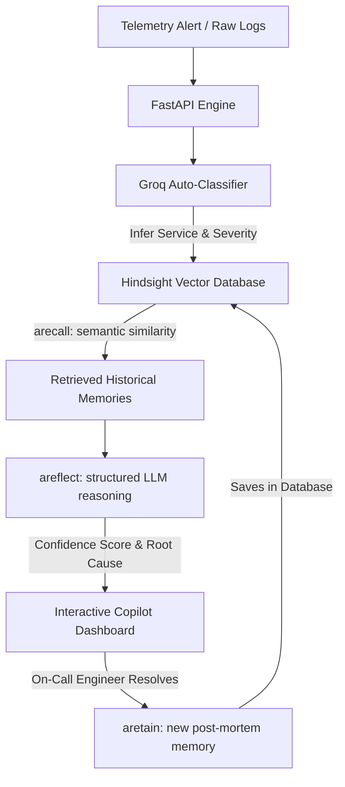

# 🛡️ Nexus Sentinel

<p align="center">
  
  
  
  
  
  
</p>

<p align="center">
  <strong>The Persistent AI Incident Intelligence Agent That Never Forgets.</strong><br />
  Powered by <strong>Hindsight Cloud</strong> vector memory and <strong>Groq (Llama-3.1)</strong>.
</p>

View Demo : https://youtu.be/y2S9Y5KLVXo
---

## 📌 Problem Statement
In modern DevOps environments, on-call teams are constantly overwhelmed by repetitive alerts, transient service failures, and critical system incidents. When an outage occurs, engineers waste valuable hours query-hunting logs, searching stale playbooks, and manually tracing root causes, completely detached from historical incident knowledge. The lack of a unified, persistent memory engine means that whenever a resolved issue resurfaces, teams must troubleshoot it from scratch, leading to high Mean Time to Resolution (MTTR), recurring configuration drift, and severe developer fatigue.

## 💡 Solution Brief
**Nexus Sentinel** is an autonomous incident intelligence platform that acts as a co-pilot for on-call engineers. It continuously scans live alert sources (such as GitHub issues, AWS Status feeds, or custom raw server logs), auto-classifies the incident type and severity, and links it directly to historical knowledge. The core agent reads incoming telemetry, runs semantic search across previous incident reviews, and serves real-time diagnostics, playbooks, and structural reasoning to immediately guide engineers through mitigation, reducing resolution times from hours to minutes.

---

## 🧠 How We Uniquely Used Hindsight Cloud
Instead of standard document search or a static knowledge base, we leveraged **Hindsight Cloud** (Vectorize's AI vector memory database) as a dynamic, real-time learning engine for DevOps:



### 🛠️ Isolated Multi-Bank Service Routing
Rather than dumping all operational data into a single unstructured memory pool, Nexus Sentinel implements a **Multi-Bank Architecture**. Telemetry and alerts are dynamically routed to isolated service-specific memory spaces:
* 💳 **Payment Operations** → `payment-bank`
* 🔑 **Authentication & Identity** → `auth-bank`
* 🗄️ **Database Clusters** → `database-bank`
* 🌐 **API Gateway & Routing** → `gateway-bank`
* 📁 **Historical Grounding** → `devops-kb-bank`

This routing prevents semantic noise. For example, database connection timeouts are matched *exclusively* against historical database patterns, ensuring that the retrieved fixes are highly contextual and functionally relevant.

---

### 🔄 The Infinite Learning Loop (`.aretain`)
Nexus Sentinel doesn't rely on static playbooks. It implements an autonomous, self-improving memory cycle:
* **Real-time vectorization**: The moment an on-call engineer mitigates an issue and hits "Resolve" in the dashboard, the backend constructs a structured post-mortem report (alert logs, identified root cause, and verified configuration patch).
* **Metadata indexing**: The report is sent to Hindsight's vector space labeled with critical metadata (Incident ID, Service, Severity level, Resolution Timestamp).
* **Instant training**: The agent instantly absorbs this new solution, making it immediately available for future alerts without requiring any manual documentation or wiki updates.

---

### 🔍 Semantic Similarity Matching (`.arecall`)
Standard log parsers and keyword filters fail when error variables, timestamps, and thread IDs change. Hindsight enables Nexus Sentinel to achieve **Fuzzy Semantic Recall**:
* **Vector distance matching**: Raw logs and stack traces are compared based on semantic meaning rather than exact strings.
* **TTR calculation**: The system automatically pulls matching cases from our pre-seeded **502 DevOps historical incidents** to calculate an expected Time-to-Resolve (TTR).
* **Resolution pre-fetching**: It retrieves the exact solutions that resolved similar trace patterns in the past, even if the current error message is formatted differently or occurs in a separate microservice.

---

### 🧠 Structured Reasoning Enforcement (`.areflect`)
Surface-level search results can be confusing during a high-pressure outage. Nexus Sentinel leverages Hindsight's reflection engine to synthesize raw search data:
* **Retrieval-Augmented Generation (RAG)**: The retrieved past incidents are combined with Groq (Llama-3.1) reasoning inside Hindsight.
* **Strict Schema Enforcement**: We enforce a strict JSON output schema. The AI must structure its output into distinct sections: **Root-Cause Reasoning**, **Actionable Playbook Steps**, and **Match Confidence Score**.
* **Confidence Grading**: The system automatically determines alert severity levels (e.g., *Critical Known* vs *New Pattern*) based on Hindsight's confidence probability, preventing visual noise for on-call engineers.

---

## 📊 Traditional Response vs. Nexus Sentinel

| Metric / Feature | Traditional Incident Response | Nexus Sentinel + Hindsight |
| :--- | :--- | :--- |
| **Investigation Speed** | 2+ hours searching logs & querying peers | **Under 8 minutes** via automated recall |
| **Playbook Accuracy** | Stale static documents or no docs | **Real-time, dynamic recommendations** |
| **Knowledge Base** | Unused wiki pages | **Self-learning vector memory** |
| **Alert Diagnostics** | Raw log dumps and stack traces | **Auto-classified severity & context** |

---

## ⚡ Key Features

* **Vibrant Tech Dashboard**: A futuristic, light-themed tech dashboard with animated grid matrix backdrops, floating scanning elements, and responsive gradient layers.
* **Continuous Seeding & Knowledge Injection**: Includes a one-time setup that parses a historical DevOps dataset of **502 incidents** directly into Hindsight's vector space.
* **Auto-Classification Pipeline**: Uses Groq to parse raw unstructured logs, metrics, or natural language alerts into structured objects (affected service, type, severity, and root cause hypothesis).
* **Live DevOps Alerts Feed**: Direct integrations with GitHub actions (ci-failures/issues) and public status APIs (Stripe, Cloudflare, GitHub, AWS RSS feeds).
* **Interactive Investigation Console**: Fully featured debugging playground where engineers can query the AI Copilot, inspect confidence levels, review matched services, and retrieve Playbook recommendations.

---

## 🛠️ Tech Stack

* **Frontend**: React, TypeScript, TailwindCSS, Lucide Icons, Vite, Lenis Smooth Scroll.
* **Backend**: FastAPI (Python), SQLite (SQLAlchemy), Pydantic Settings.
* **AI & Memory**: Hindsight Python SDK, Groq API (Llama-3.1-8b).

---

## 🚀 Getting Started

### 1. Backend Setup
1. Navigate to the backend directory:
   ```bash
   cd backend
   ```
2. Create and activate a virtual environment:
   ```bash
   python -m venv venv
   source venv/bin/activate  # On Windows: venv\Scripts\activate
   ```
3. Install dependencies:
   ```bash
   pip install -e .
   ```
4. Set up environment variables in `backend/.env` (using keys for Hindsight, Groq, and GitHub).
5. Start the FastAPI server:
   ```bash
   uvicorn app.main:app --reload
   ```

### 2. Frontend Setup
1. Navigate to the frontend directory:
   ```bash
   cd frontend
   ```
2. Install npm dependencies:
   ```bash
   npm install
   ```
3. Start the Vite development server:
   ```bash
   npm run dev
   ```

---

*Nexus Sentinel © 2026. Powered by Hindsight Cloud.*
