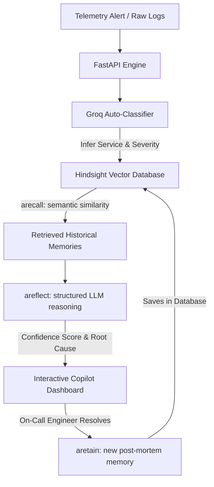

# 🛡️ Nexus Sentinel

<p align="center">
  
  
  
  
  
  
</p>

<p align="center">
  <strong>The Persistent AI Incident Intelligence Agent That Never Forgets.</strong><br />
  Powered by <strong>Hindsight Cloud</strong> vector memory and <strong>Groq (Llama-3.1)</strong>.
</p>

---

## 📌 Problem Statement
In modern DevOps environments, on-call teams are constantly overwhelmed by repetitive alerts, transient service failures, and critical system incidents. When an outage occurs, engineers waste valuable hours query-hunting logs, searching stale playbooks, and manually tracing root causes, completely detached from historical incident knowledge. The lack of a unified, persistent memory engine means that whenever a resolved issue resurfaces, teams must troubleshoot it from scratch, leading to high Mean Time to Resolution (MTTR), recurring configuration drift, and severe developer fatigue.

## 💡 Solution Brief
**Nexus Sentinel** is an autonomous incident intelligence platform that acts as a co-pilot for on-call engineers. It continuously scans live alert sources (such as GitHub issues, AWS Status feeds, or custom raw server logs), auto-classifies the incident type and severity, and links it directly to historical knowledge. The core agent reads incoming telemetry, runs semantic search across previous incident reviews, and serves real-time diagnostics, playbooks, and structural reasoning to immediately guide engineers through mitigation, reducing resolution times from hours to minutes.

---

## 🧠 How We Uniquely Used Hindsight Cloud
Instead of standard document search or a static knowledge base, we leveraged **Hindsight Cloud** (Vectorize's AI vector memory database) as a dynamic, real-time learning engine for DevOps:



### 🛠️ Multi-Bank Routing Architecture
To optimize semantic queries and prevent data cross-contamination, Nexus Sentinel maps incoming microservice alerts to dedicated Hindsight memory banks based on a prefix routing helper:
* 💳 `payment` service → `payment-bank`
* 🔑 `auth` service → `auth-bank`
* 🗄️ `database` service → `database-bank`
* 🌐 `gateway` service → `gateway-bank`
* 📁 Dataset records → `devops-kb-bank`

---

### 1. Dynamic Incident Learning (`.aretain`)
When an engineer marks an incident as resolved, the post-mortem analysis (symptoms, root cause, and verified configuration resolution) is vectorized and committed to the respective Hindsight microservice memory bank. This creates a real-time feedback loop.

```python
# Retaining a resolved incident in Hindsight
ret = await memory_client.client.aretain(
    bank_id=bank_id,
    content=(
        f"Incident: {incident.title}\n"
        f"Description: {incident.description}\n"
        f"Resolution: {incident.resolution}"
    ),
    context=f"resolved incident review for {incident.service}",
    timestamp=incident.created_at,
    document_id=f"incident_{incident.id}",
    metadata={
        "incident_id": str(incident.id),
        "service": incident.service,
        "severity": incident.severity.value,
        "status": incident.status.value,
        "timestamp": incident.created_at.isoformat()
    }
)
```

---

### 2. Semantic Similarity-Based Recall (`.arecall`)
Traditional keyword-based log searching fails when matching variable-heavy stack traces. Nexus Sentinel leverages vector similarity to locate the top matches from previous incidents (including the 502 records from the historical DevOps CSV dataset) in milliseconds, regardless of differences in naming or log structure.

```python
# Recalling similar past incidents from the Hindsight bank
response = await memory_client.client.arecall(
    bank_id=bank_id,
    query=f"{incident.title} {incident.description} {incident.service}"
)

# Extracts metadata details like TTR (Time to Resolve) and verified playbooks
for match in response.results:
    print(f"Matched text: {match.text}")
    print(f"Resolution: {match.metadata.get('resolution')}")
```

---

### 3. Retrieval-Augmented Structured Reflection (`.areflect`)
Rather than outputting unstructured strings, the engine calls `.areflect()` with a custom JSON response schema. This guarantees that Hindsight's vector memory and LLM reasoning engine return a perfectly structured, type-safe diagnostic packet directly readable by the Copilot dashboard.

```python
# Structured reflection schema to constrain LLM responses
schema = {
    "type": "object",
    "properties": {
        "reasoning": {
            "type": "string", 
            "description": "Evidence-based summary linking the alert to historical causes."
        },
        "recommended_action": {
            "type": "string", 
            "description": "Actionable, concrete playbook steps."
        },
        "confidence_score": {
            "type": "number", 
            "description": "Similarity match probability (0.0 to 1.0)."
        }
    },
    "required": ["reasoning", "recommended_action", "confidence_score"]
}

# Reflecting facts in Hindsight to synthesize playbooks
response = await memory_client.client.areflect(
    bank_id=bank_id,
    query=raw_alert_logs,
    include_facts=True,
    response_schema=schema
)
```

---

## 📊 Traditional Response vs. Nexus Sentinel

| Metric / Feature | Traditional Incident Response | Nexus Sentinel + Hindsight |
| :--- | :--- | :--- |
| **Investigation Speed** | 2+ hours searching logs & querying peers | **Under 8 minutes** via automated recall |
| **Playbook Accuracy** | Stale static documents or no docs | **Real-time, dynamic recommendations** |
| **Knowledge Base** | Unused wiki pages | **Self-learning vector memory** |
| **Alert Diagnostics** | Raw log dumps and stack traces | **Auto-classified severity & context** |

---

## ⚡ Key Features

* **Vibrant Tech Dashboard**: A futuristic, light-themed tech dashboard with animated grid matrix backdrops, floating scanning elements, and responsive gradient layers.
* **Continuous Seeding & Knowledge Injection**: Includes a one-time setup that parses a historical DevOps dataset of **502 incidents** directly into Hindsight's vector space.
* **Auto-Classification Pipeline**: Uses Groq to parse raw unstructured logs, metrics, or natural language alerts into structured objects (affected service, type, severity, and root cause hypothesis).
* **Live DevOps Alerts Feed**: Direct integrations with GitHub actions (ci-failures/issues) and public status APIs (Stripe, Cloudflare, GitHub, AWS RSS feeds).
* **Interactive Investigation Console**: Fully featured debugging playground where engineers can query the AI Copilot, inspect confidence levels, review matched services, and retrieve Playbook recommendations.

---

## 🛠️ Tech Stack

* **Frontend**: React, TypeScript, TailwindCSS, Lucide Icons, Vite, Lenis Smooth Scroll.
* **Backend**: FastAPI (Python), SQLite (SQLAlchemy), Pydantic Settings.
* **AI & Memory**: Hindsight Python SDK, Groq API (Llama-3.1-8b).

---

## 🚀 Getting Started

### 1. Backend Setup
1. Navigate to the backend directory:
   ```bash
   cd backend
   ```
2. Create and activate a virtual environment:
   ```bash
   python -m venv venv
   source venv/bin/activate  # On Windows: venv\Scripts\activate
   ```
3. Install dependencies:
   ```bash
   pip install -e .
   ```
4. Set up environment variables in `backend/.env` (using keys for Hindsight, Groq, and GitHub).
5. Start the FastAPI server:
   ```bash
   uvicorn app.main:app --reload
   ```

### 2. Frontend Setup
1. Navigate to the frontend directory:
   ```bash
   cd frontend
   ```
2. Install npm dependencies:
   ```bash
   npm install
   ```
3. Start the Vite development server:
   ```bash
   npm run dev
   ```

---

*Nexus Sentinel © 2026. Powered by Hindsight Cloud.*
